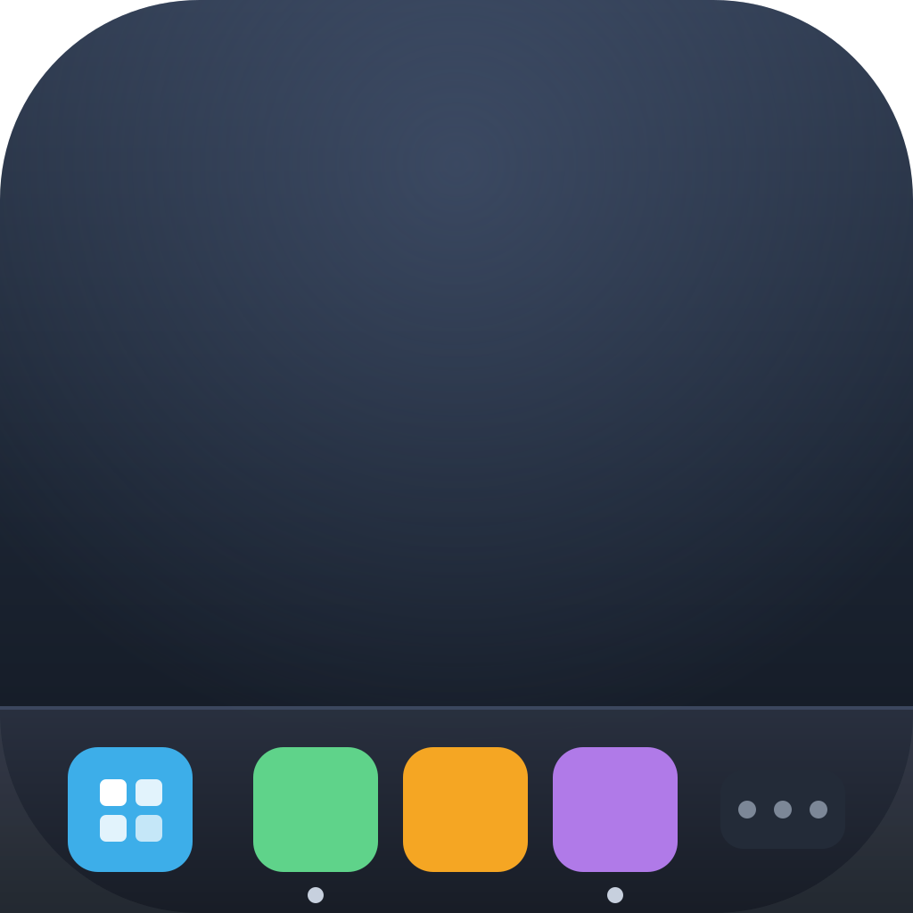
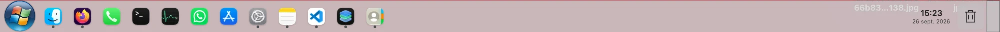
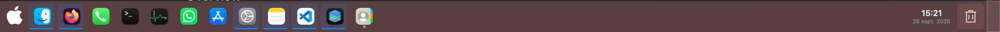
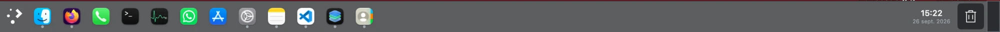
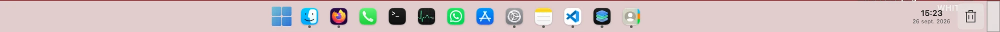

<p align="center">
  
</p>

<h1 align="center">TaskbarReplacement</h1>

<p align="center">
  Une barre des tâches façon KDE Plasma qui remplace le Dock de macOS.
</p>

<p align="center">
  🇫🇷 Français | 🇬🇧 <a href="README.md">English</a>
</p>

## Présentation

TaskbarReplacement remplace le Dock macOS par une vraie barre des tâches à la Windows/KDE : icônes des applications ouvertes, bouton démarrer avec menu d'applications, horloge, épinglage — le tout personnalisable via un système de thèmes en dossiers JSON, sans toucher au code.

Projet personnel, pas affilié à KDE ni à Microsoft — juste inspiré de leur look.

## Fonctionnalités

- **Barre des tâches** : icônes des fenêtres ouvertes (regroupées si plusieurs fenêtres par app), épinglage d'applications, réduction de toutes les fenêtres, horloge (avec date en option), corbeille.
- **Édition des icônes** : rester appuyé sur une icône (ou clic droit sur la barre → **Mode Édition**) fait trembler toutes les icônes, comme sur iOS — dans ce mode, on peut les glisser pour les réorganiser (aperçu en direct, écrit dans le vrai Dock seulement à la sortie du mode), taper sur une icône pour lui donner une image personnalisée, et glisser une app depuis le Finder directement sur la barre pour l'épingler.
- **Taille et espacement des icônes** : réglables en pourcentage, indépendamment de la hauteur de la barre.
- **Alignement** : icônes alignées à gauche, centrées, ou centrées avec le bouton démarrer.
- **Auto-hide** : la barre peut se rétracter automatiquement, comme sous Windows.
- **Menu démarrer**, au choix :
  - **Kickoff** (façon Plasma) : recherche, catégories, grille d'applications.
  - **Windows 11** : recherche, grille d'applications épinglées ou complète.
  - **Windows 7** : liste épinglée/toutes applications triée par lancement le plus récent, photo de compte, liens rapides.
  - **Spotlight** : ouvre directement le vrai Spotlight de macOS, sans interface propre.
  - Chaque style affiche ta vraie photo de compte macOS et se navigue entièrement au clavier (flèches + Entrée), et cliquer sur la photo ouvre **Réglages Système → Compte Apple**.
- **Thèmes** : Breeze (clair/sombre), macOS, Windows 7, Windows 10, Windows 11, Windows XP — chacun avec un mode Clair / Sombre / Automatique (suit le système), indépendant du choix du thème.
- **Liquid Glass** : fond translucide avec intensité réglable.
- **Multilingue** : français, anglais, espagnol, russe (ou suit la langue du système).
- **Démarrage automatique** avec la session, via l'API native macOS.

Tous les réglages sont accessibles par clic droit sur la barre → **Paramètres…**.

## Captures d'écran

**Windows 7**


**macOS**


**Breeze (KDE)**


**Windows 11** (icônes centrées)


## Installation

1. Télécharger `TaskbarReplacement-Installer.dmg` depuis la [dernière release](../../releases/latest).
2. Ouvrir le DMG et glisser `TaskbarReplacement.app` dans le dossier **Applications**.
3. Au premier lancement, macOS bloquera l'ouverture (l'app n'est pas notariée par Apple — c'est un projet personnel, auto-signé) : faire **clic droit sur l'app → Ouvrir → Ouvrir** dans la boîte de dialogue. Cette étape n'est nécessaire qu'une seule fois.
4. Autoriser l'accès à l'**Accessibilité** quand macOS le demande (nécessaire pour gérer les fenêtres des autres applications).

## Compiler depuis les sources

Nécessite uniquement les Command Line Tools (pas besoin d'Xcode complet) et macOS 14+.

```bash
git clone https://github.com/Kosnix/TaskbarReplacement.git
cd TaskbarReplacement
swift build
```

Pour obtenir une vraie `.app` installable (icône, Info.plist, signature) plutôt qu'un simple exécutable :

```bash
bash Scripts/build-app.sh --install
```

Astuce : lancer d'abord `bash Scripts/setup-signing-identity.sh` une fois — ça crée une identité de signature locale stable, pour que macOS ne redemande pas la permission Accessibilité à chaque recompilation.

## Créer ses propres thèmes

Chaque thème est un simple dossier sous `Sources/Resources/Themes/<nom>/` avec :
- `theme.json` — nom, auteur, variante (`light`/`dark`)
- `tokens.json` — couleurs, tailles, espacements
- `layout.json` — quels modules apparaissent dans quelle zone de la barre
- `icons/` — icônes SVG recolorables

Un thème `<nom>-light` et `<nom>-dark` avec le même préfixe forment automatiquement une seule entrée dans le sélecteur de thème, avec le mode clair/sombre géré séparément.

## Avertissement

Projet personnel de bricolage, pas un produit distribué ni maintenu comme tel. L'application n'est pas notariée par Apple et modifie des réglages système (Dock, permissions). À utiliser en connaissance de cause.
